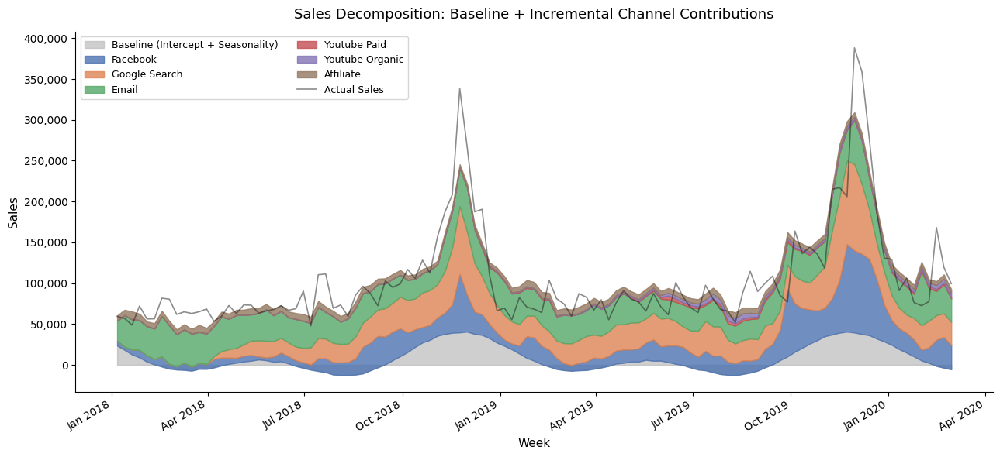
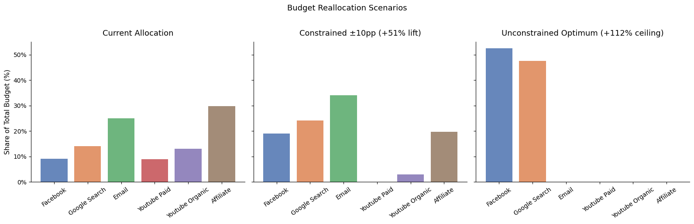

# Marketing Mix Model: Budget Optimization

## Business Question

**Given a fixed marketing budget, are we spending it in the right places, and how should we reallocate it?**

---

## Approach

Traditional attribution (last-click, or "naive ROAS") systematically misleads budget decisions: it ignores the delayed effect of advertising (you see an ad Monday, you buy Friday) and the diminishing returns from overinvesting in a single channel (doubling Facebook spend doesn't double Facebook sales).

Marketing Mix Modeling (MMM) addresses both problems. By fitting a Bayesian model with **adstock** (time-lagged carry-over effects) and **saturation** (diminishing-returns) transformations, we get a far more credible estimate of each channel's contribution to sales than last-click attribution — still observational, not a causal experiment — and use it to optimize how the budget should be split.

---

## Data

Kaggle "Division-Level Marketing Spend Dataset" (`data/media_spends.csv`):
weekly marketing activity and sales for 26 retail divisions over 113 weeks
(Jan 2018 – Feb 2020). The model only fits on Division A — a single
representative market of 113 weekly observations; the same structure applies
to any division.

Six media channels are used as predictors, with weekly Sales as the target:

| Model channel | Source column |
|---|---|
| Facebook | Facebook_Impressions |
| Google Search | Google_Impressions |
| Email | Email_Impressions |
| YouTube Paid | Paid_Views |
| YouTube Organic | Organic_Views |
| Affiliate | Affiliate_Impressions |

Note: these are impression/view counts, not dollar spend, so they're treated
as a spend proxy and all allocations are expressed in normalized activity
units (see Caveats).

---

## Key Findings

The model includes annual seasonality (Fourier terms) and a non-negative baseline, fits well (in-sample R² ≈ 0.80 against the posterior predictive mean), and samples cleanly (4 chains, zero divergences, max r-hat 1.003).

- **Email, Google Search, and Facebook drive ~91% of incremental sales** (35%, 31%, and 25% respectively) — Email on only ~25% of total activity.
- **Over half of current activity sits in channels that barely move sales:** YouTube Paid, YouTube Organic, and Affiliate together receive ~52% of activity but contribute ~9% of incremental sales, with effectiveness coefficients near zero.
- **Uncertainty is material and reported:** Email's incremental share carries a 94% HDI of 17–51%, which is why the recommendation below is staged rather than all-in.



---

## Recommendation

A staged reallocation capped at ±10pp per channel: shift budget toward Google Search, Facebook, and Email, funded by cuts to Affiliate and both YouTube channels. Projected incremental sales lift at constant total spend: **+51%** (94% HDI: 43–67%, from re-optimizing under 200 posterior draws).

The unconstrained mathematical optimum projects +112% but concentrates the entire budget in Facebook and Google Search — reported as a ceiling, not a recommendation. Both figures come from static response curves at mean weekly spend and ignore adstock timing, so they are optimistic upper bounds to be validated with a holdout test rather than forecasts.



---

## Repository Structure

```
mmm-budget-optimization/
├── assets/                       # Charts exported from the notebook
├── data/
│   └── media_spends.csv          # Kaggle dataset
├── notebooks/
│   └── mmm_analysis.ipynb        # End-to-end analysis: EDA → MMM fit → optimization
├── requirements.txt
└── README.md
```

---

## How to Run

### 1. Install dependencies

```bash
# Create a virtual environment (recommended)
python -m venv .venv
source .venv/bin/activate   # macOS / Linux
# .venv\Scripts\activate    # Windows

# Install packages
pip install -r requirements.txt
```

### 2. Launch the notebook

```bash
jupyter notebook notebooks/mmm_analysis.ipynb
```

Run all cells top-to-bottom (**Kernel → Restart & Run All**). The full notebook takes a few minutes; MCMC sampling itself runs in under a minute on a modern laptop.

---

## Caveats

- **Single market:** The model is fit on Division A (one of 26). Results are directionally representative but should be validated across divisions before acting on them.
- **Impressions as spend proxy:** The dataset contains impression/view counts rather than dollar spend, so budget allocation is expressed in normalized activity units. A production version would use actual media spend in dollars.
- **Limited controls:** Annual seasonality is modeled with Fourier terms, but competitor activity, pricing, promotions, and macro-economic factors are not. In a production MMM, these would be included as control variables to better isolate media contribution.
